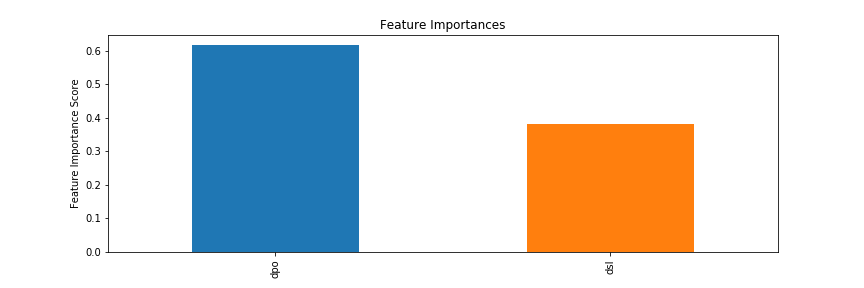
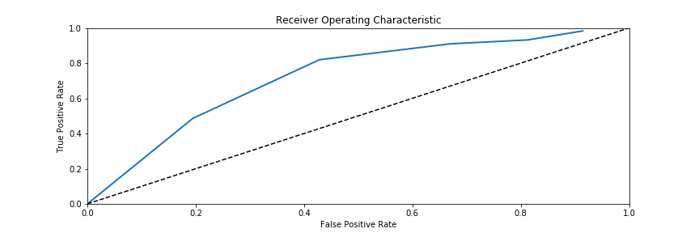
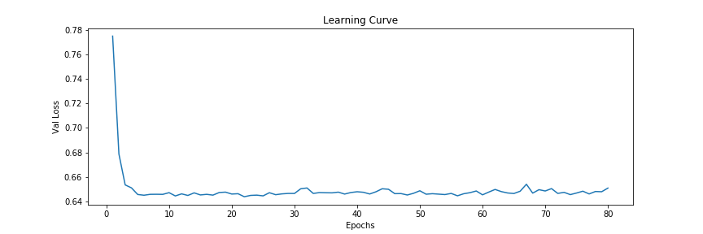
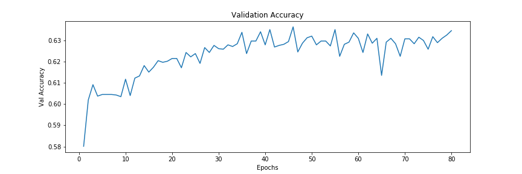

# Purchase Intent Model
A predictive model for customer purchase behavior in e-commerce context.

## Dataset
* This dataset tries to capture customer purchase behavior in baby category.
* This dataset includes 100 mother users from the mother cluster, resulting from K-means clustering based on purchase history.
* The K-means clustering was performed on top 20% users of year 2017.
* For each dataset, datapoint was sampled at uniform time interval (7 days).
* For each sampled reference time, the sample is labelled 1 if user placed an order in baby category within 7 days. Otherwise it's labelled 0.

## Features
* Exponential moving averages of aggregate spending (ema)
* Average days between orders (dpo)
* Average days per quantity purchased (dpq)
* Days since last purchase in all categories (dsl)
* Average browse between consecutive purchases in all categories (bpo, bpo_e)
* Average browse per quantity purchased (bpq)
* Browse since most recent purchase (bsl)
* Average GMV per day between consecutive purchases (gpo, gpo_e)
* GMV / order (gpo)
* GMV / quantity (gpq)
* GMV / day = (GMV / order) / (day / order) (gpd)
* GMV per day since most recent purchase in category (gsl)
: 

## Model
- Multi-Layered Neural Net Binary Classifer
- See def Build_Model() for details
- Only 2 features are included: days per order (gpo), days since last order (dsl)

## Performance
: 
* baseline = 0.59217
* True positive(tp) = 77
* True negative(tn) = 213
* False positive(fp) = 44
* False negative(fn) = 100
* precision = 0.63636
* recall = 0.43503
* accuracy = 0.66820
* True Positive Rate(TPR) = 0.43503
* False Positive Rate(FPR) = 0.17121

: 

: 

## Generalize
Applying the purchase intent model to 45 categories, it is clear that the most predictive categories are baby categories (formula, diapers, etc.), pet categories (dog, cat, others), and food categories (meal essentials, healthy food, kitchen). This makes logical sense as baby, pet, and food are regularly recurring obligation that must be satisfied on predictable time intervals.

Less predictable categories are sports shoes, health appliances, computers and cell phones. It stands to reason that orders from those categories stem from unpredictive motives.

